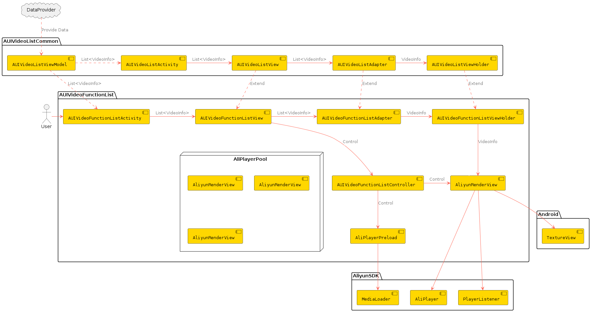

# **AUIVideoFunctionList**

## **1. Module Introduction**

**AUIVideoFunctionList** module uses multiple player instances (AliPlayer) + preload (MediaLoader) + prerender to achieve short video list playback, combined with local caching can achieve better experience.

## **2. Prerequisites**

You have obtained the player license authorization and License Key for the Audio-Video Terminal SDK. For information on obtaining the license, please refer to [申请License](https://help.aliyun.com/zh/apsara-video-sdk/user-guide/license-authorization-and-management#13133fa053843)。

## **3. Compilation and Execution**

1. Integrate the authorized Audio-Video Terminal SDK license.

   For detailed instructions, please refer to [Bind a license](https://www.alibabacloud.com/help/en/apsara-video-sdk/user-guide/access-to-license)。
   
2. Copy the AUIVideoFunctionList and AUIVideoListCommon modules from the AUIVideoList directory into your project.

   Make sure to modify the compile version and the player SDK version in the build.gradle files of these modules to match your project settings.

   The player SDK version can be configured in AUIVideoListCommon/build.gradle (refer to the externalPlayerFull in AndroidThirdParty/config.gradle).

3. In the repositories configuration of your project's gradle file, add the Maven source for the Alibaba Cloud SDK:

   ```groovy
   maven { url "https://maven.aliyun.com/repository/releases" }
   ```
   
4. Add the module reference and dependency.

   In your project's setting.gradle, add:
   ```groovy
   // The project root directory contains an AUIVideoList folder with the AUIVideoListCommon and AUIVideoFunctionList modules. 
   include ':AUIVideoList:AUIVideoListCommon'
   include ':AUIVideoList:AUIVideoFunctionList' 
   // If these modules are directly placed under the root directory, include them as ':AUIVideoListCommon' and ':AUIVideoFunctionList'
   ```

   In the build.gradle of your app module, add:
   ```groovy
   implementation project(':AUIVideoList:AUIVideoFunctionList')
   // Similarly, if this module is placed under the root directory, just write ':AUIVideoFunctionList'
   ```
   
5. Configure page navigation to open the main interface of the corresponding module from the current page.

   ```java
   Intent videoListFunctionIntent = new Intent(this, AUIVideoFunctionListActivity.class);
   startActivity(videoListFunctionIntent);
   ```
   
### **Integration FAQ**

1. Error “Namespace not specified”

   Please check your AGP version. If it's a newer version (like 8.3.2), you need to manually add the namespace setting in each module's build.gradle file. For older AGP versions, this configuration is located in the package attribute of the module's /src/main/res/AndroidManifest.xml.

2. Gradle conflict during repository priority processing

   Please add the repository in setting.gradle as a priority.

## **Module Description**
### **File Description**

```html
.
└── videoefunctionlist                                     # Root directory
    ├── AUIFunctionListPlayerActivity.java                 # Functionlist page
    ├── AUIVideoFunctionListController.java                # Functionlist page controller
    ├── AUIVideoFunctionListView.java                      # Video list view
    ├── adapter                                           
    │   ├── AUIVideoFunctionListAdapter.java               # Functionlist panel adapter
    │   └── AUIVideoFunctionListLayoutManager.java         # Layout manager
    └── player                                          
        ├── AliPlayerPool.java                                      # Player pool
        ├── AliPlayerPreload.java                          # Preloading
        └── AliyunRenderView.java                          # Video rendering and playback
```

### **Architecture Design**



### **Entry Page**

* **AUIVideoFunctionListActivity**

**External Integration:**：If you need to use the multiple instance page as an atomic page for external navigation, remove the DataProvider and pass the List<VideoInfo> data to the current page during navigation.

### **Data Source**

The data in the current demo is obtained from the local videolist.json.

Data retrieval logic: AUIVideoListViewModel.DataProvider<List\<VideoInfo\>> dataProvider, which requests data via onLoadData.

If you need to load data via API, you can rewrite the load data function and pass the List<VideoInfo> data directly.

## **5. Core Capabilities Introduction**

This component leverages the Alibaba Cloud Player SDK, implementing playback through multiple player instances (AliPlayer) + preloading (MediaLoader) + prerendering, utilizing features like preloading, prerendering, HTTPDNS, and encrypted playback to significantly enhance the viewing experience in terms of playback delay, stability, and security. For more details, refer to [进阶功能](https://help.aliyun.com/zh/vod/developer-reference/advanced-features)。

### **Preload**

```java
// Load using the MediaLoader component of the Alibaba Cloud Player SDK
private void load(String url) {
    if(!mIsLive){
        mMediaLoader.load(url, GlobalSettings.DURATION);
    }
}
// Cancel loading
private void cancel(String url) {
    if(!mIsLive){
        mMediaLoader.cancel(url);
    }
}
// Load the next media resource
private void loadNext() {
    if (hasNext(mOldPosition.get())) {
        int next = mOldPosition.incrementAndGet();
        load(mUrlLinkedList.get(next).getUrl());
    }
}
// Move to a specified position and load the videos afterwards
public void moveToSerial(int position) {
    mExecutorService.execute(() -> {
        //cancel first
        int i = mOldPosition.get();
        if (i >= 0 && i < mUrlLinkedList.size()) {
            cancel(mUrlLinkedList.get(mOldPosition.get()).getUrl());
        }
        //load
        if (hasNext(position)) {
            load(mUrlLinkedList.get(position + 1).getUrl());
        }
       mOldPosition.set(position + 1);
    });
}
```

### **Page Event Response**

```java
// Selected a video
public void onPageSelected(int position, AUIVideoListViewHolder viewHolder) {
    this.mCurrentPosition = position;
    mIsPreloading = false;
    mAliPlayerPreload.cancel(position);
    if (viewHolder instanceof AUIVideoFunctionListAdapter.AUIVideoFunctionListViewHolder) {
        AliyunRenderView aliPlayer = ((AUIVideoFunctionListAdapter.AUIVideoFunctionListViewHolder) viewHolder).getAliPlayer();
        aliPlayer.getAliPlayer().start();
    }
}
// When the page is halfway scrolled
public void onPageHideHalf(int position, AUIVideoListViewHolder viewHolder) {
    if (viewHolder instanceof AUIVideoFunctionListAdapter.AUIVideoFunctionListViewHolder) {
        ((AUIVideoFunctionListAdapter.AUIVideoFunctionListViewHolder) viewHolder).getAliPlayer().pause();
        viewHolder.showPlayIcon(false);
    }
}
// When the page is released
public void onPageRelease(int position, AUIVideoListViewHolder viewHolder) {
    if (viewHolder instanceof AUIVideoFunctionListAdapter.AUIVideoFunctionListViewHolder) {
        ((AUIVideoFunctionListAdapter.AUIVideoFunctionListViewHolder) viewHolder).getAliPlayer().pause();
    }
}
```

### **Multi-instance Player Pool**

```java
// Initialize the queue of AliyunRenderView instances
public static void init(Context context) {
    if (mDequeue.size() != TOTAL_SIZE) {
        mDequeue.clear();
        mDequeue.add(new AliyunRenderView(context));
        mDequeue.add(new AliyunRenderView(context));
        mDequeue.add(new AliyunRenderView(context));
    }
}
// Get an AliyunRenderView instance
public static AliyunRenderView getPlayer() {
    AliyunRenderView aliyunRenderView = mDequeue.pollFirst();
    mDequeue.addLast(aliyunRenderView);
    return aliyunRenderView;
}
// Enable or disable loop playback
public static void openLoopPlay(boolean openLoopPlay) {
    for (AliyunRenderView aliyunRenderView : mDequeue) {
        aliyunRenderView.openLoopPlay(openLoopPlay);
    }
}
```

### **Prerender**

```java
private void invokeSeekTo() {
    if (mHasCreateSurface && mHasPrepared) {
        mAliPlayer.seekTo(0);
        mHasCreateSurface = false;
        mHasPrepared = false;
    }
}
```
### **HTTPDNS**

HTTPDNS can provide faster and more stable DNS resolution services. By replacing traditional DNS resolution, it can reduce DNS resolution time, improve video playback loading speed and stability, thus enhancing user viewing experience.

From version 6.12.0, HTTPDNS is automatically enabled in both the Audio-Video Terminal SDK and the Player SDK.

### **Video Encryption**

From version 6.8.0, both the Audio-Video Terminal SDK and the Player SDK support private encryption playback for MP4 videos.

- MP4 videos with private encryption must meet the following conditions to be played normally:
  - The business side (App side) must append `etavirp_nuyila=1` to the video URL when passing it to the player.
  - The uid of the App's License must be consistent with the uid that generated the private encrypted MP4.
- To verify whether the encrypted video is correct, check the privately encrypted video URL:
  - Meta information contains the `AliyunPrivateKeyUri` tag.
  - Cannot be played directly by ffplay.

### **Other Features**

- **Screen Recording Prevention**

  Screen recording prevention blocks the playback process by monitoring screen recording and screenshot behaviors, effectively protecting video content rights from unauthorized recording and distribution.

## 6. User Guide

### **Documentation**

[ApsaraVideo Player SDK](https://www.alibabacloud.com/help/en/vod/developer-reference/apsaravideo-player-sdk/)

[ApsaraVideo MediaBox SDK](https://www.alibabacloud.com/en/product/mediabox_sdk)

[ApsaraVideo VOD](https://www.alibabacloud.com/en/product/apsaravideo-for-vod/)

[视频点播控制台](https://vod.console.aliyun.com)

[ApsaraVideo VOD](https://www.alibabacloud.com/zh/product/apsaravideo-for-vod)


### **FAQ**

If you have any questions or suggestions regarding the player SDK, feel free to join the Alibaba Cloud Player SDK developer group by searching for group number 31882553 on DingTalk.

